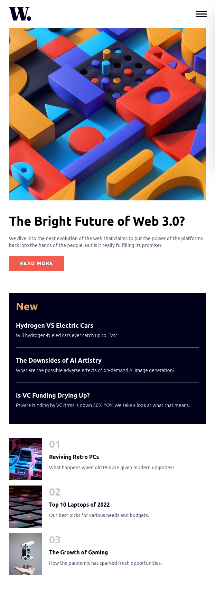

# Frontend Mentor - News homepage solution

This is a solution to the [News homepage challenge on Frontend Mentor](https://www.frontendmentor.io/challenges/news-homepage-H6SWTa1MFl). Frontend Mentor challenges help you improve your coding skills by building realistic projects. 

## Table of contents

- [Overview](#overview)
  - [The challenge](#the-challenge)
  - [Screenshot](#screenshot)
  - [Links](#links)
- [My process](#my-process)
  - [Built with](#built-with)
  - [What I learned](#what-i-learned)
  - [Continued development](#continued-development)
  - [Useful resources](#useful-resources)
- [Author](#author)

## Overview

### The challenge

Users should be able to:

- View the optimal layout for the interface depending on their device's screen size
- See hover and focus states for all interactive elements on the page

### Screenshots

### Links

- Solution URL: https://github.com/Mirror83/news-homepage
- Live Site URL: https://mirror83.github.io/news-homepage

## My process
I took on this project primarily to learn the basics of [Tailwind CSS](https://tailwindcss.com/), but it also ended up serving as a refresher on CSS concepts (as well as a reminder that I hadn't done web develpoment in a while).

I used a desktop-first approach with this and worked all my way down to the mobile menu.

### Built with

- HTML5 markup
- Flexbox
- CSS Grid
- [Tailwind CSS](https://tailwindcss.com/)
- Vanilla Javascript (For the mobile menu)

### What I learned

I learned the core concepts of using Tailwind CSS including:
- Installation (for a plain HTML, CSS and Javascript project)
- How it fundamentally works
- Responsive design
- Theme customization
- Hover and transitions
- Arbitrary values
- Using custom CSS

I also got reinforce my knowledge of positions in css and also learned about inset, the short-hand for top, bottom, left and right while making the mobile menu.

### Continued development

This project is not completely done; I did not apply the Inter font-family as required. When I tried to apply the required font-family, most of the CSS of the site broke. I therefore intend to find out why this is happening and how to rectify the issue.

Other than that, I plan to learn how to use Tailwind CSS with [React](https://react.dev/) and how to perform animations with it.

### Useful resources

- [Responsive navbar tutorial using HTML, CSS and Javascript](https://www.youtube.com/watch?v=HbBMp6yUXO0&list=PPSV) - This tutorial is done by [Kevin Powell](https://www.youtube.com/@KevinPowell) and, coincidentally, is centered around another Frontend Mentor project - the [Space Tourism](https://www.frontendmentor.io/challenges/space-tourism-multipage-website-gRWj1URZ3) project. The navbar created in the tutorial is almost exactly what I needed for this project. Most of what I had to do is implement the logic he explains in the video using Tailwind CSS. He delivered the concepts very clearly and that is something that cuts across most of his other videos on CSS.

## Author

- Frontend Mentor - [@Mirror83](https://www.frontendmentor.io/profile/Mirror83)
- [LinkedIn](https://www.linkedin.com/in/glen-omondi-22b57a257)

